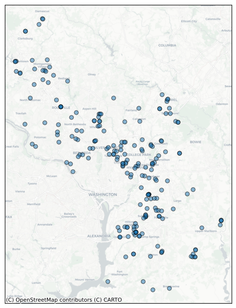
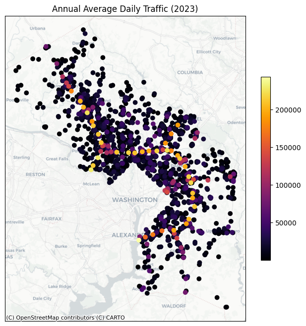
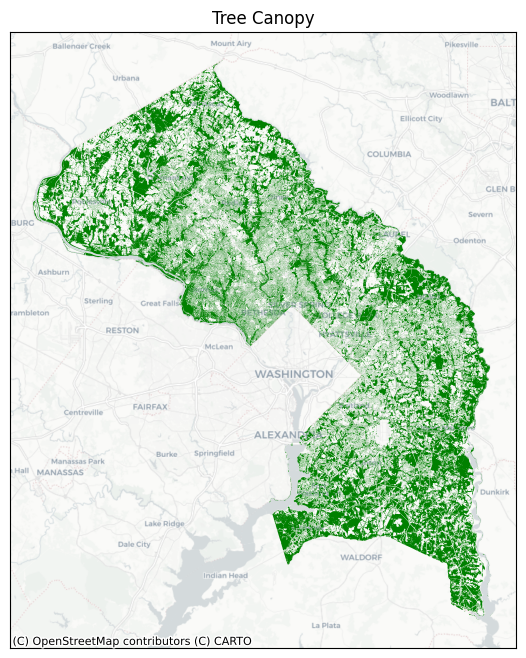
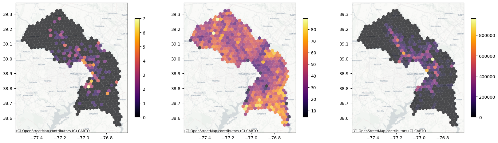
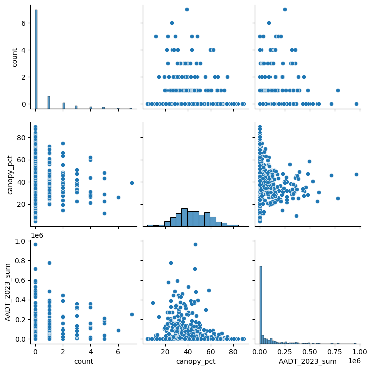
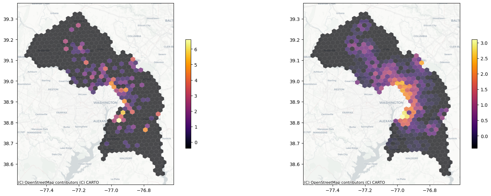

# Using emergency alert data to find patterns in sewer repairs

By Emma Furth


Depending on where you live, your local utility company may allow you to sign up for alerts about outages in your area. [WSSC Water](https://www.wsscwater.com), the main provider of water and sewer services for Prince George's and Montgomery Counties in Maryland, makes an [archive](https://www.wsscwater.com/newsroom?month=all&year=2026&type[253]=253) of such alerts from as far back as 2022 available on their website. I wrote a Python program to scrape those alerts and compile them into a dataset of all emergency repairs and maintenance publicly announced by WSSC from the last few years, including their dates, location, and the diameter of pipe involved. 




## Traffic & Trees 

Many factors can potentially lead to damage to sewer pipes, but the two I chose to focus on were tree canopy and traffic volume. Tree roots can grow into or around pipes, doing damage over time, while automobile traffic can cause vibrations whose effects add up over time.

To measure local traffic volume, I used the [Annual Average Daily Traffic](https://data-maryland.opendata.arcgis.com/datasets/mdot-sha-annual-average-daily-traffic-aadt-locations/explore?location=38.843861%2C-77.269759%2C8) (AADT) count dataset published by the Maryland Department of Transportation.



I couldn't find a single tree canopy dataset covering both Montgomery and Prince George's Counties. Instead, I took two sufficiently similar Tree Canopy polygon datasets for [Prince George's](https://gisdata.pgplanning.org/opendata/search.asp?s=Tree_Canopy_2023_Py) and [Montgomery](https://data-mcplanning.hub.arcgis.com/datasets/0276692e49bb441c8bd0a823da2de121/about) counties and combine them, as seen in the map below.



## Aggregating with H3 Hexagons

To facilitate analysis, I aggregated all three datasets into [H3 hexagons](https://h3geo.org/). I chose resolution 7, as it was the smallest resolution where most of the hexes in the alert dataset were touching at least one other hex in the set. For the alert dataset, I aggregated based on the total number of alerts within that hexagon. For the traffic data, I aggregated based on the sum of the Annual Average Daily Traffic (AADT) counts for 2023 of all locations in each hex. For tree canopy, I performed a spatial join and calculated the percent of the area of each hex covered by tree canopy. I then joined all three datasets

Then I combined them into a single data frame. 




## Poisson Regression



The histogram of the count data resembles a Poisson curve, so a Poisson regression is most appropriate here. Our null hypothesis (`H_0`) is that there is no relationship between the total number of repair alerts per hex and the total AADT or canopy cover perentage per hex. Our alternative hyopthesis (`H_a`) is that there is some relatiionship. Our significance level 0.05. A Poisson regression yields the following results:

```
                 Generalized Linear Model Regression Results                  
==============================================================================
Dep. Variable:                  count   No. Observations:                  517
Model:                            GLM   Df Residuals:                      514
Model Family:                 Poisson   Df Model:                            2
Link Function:                    Log   Scale:                          1.0000
Method:                          IRLS   Log-Likelihood:                -460.45
Date:                Thu, 07 May 2026   Deviance:                       664.67
Time:                        15:52:42   Pearson chi2:                 1.12e+03
No. Iterations:                     7   Pseudo R-squ. (CS):             0.1441
Covariance Type:            nonrobust                                         
=================================================================================
                    coef    std err          z      P>|z|      [0.025      0.975]
---------------------------------------------------------------------------------
const             0.0673      0.224      0.300      0.764      -0.372       0.507
canopy_pct       -0.0289      0.005     -5.507      0.000      -0.039      -0.019
AADT_2023_sum  2.271e-06   3.59e-07      6.330      0.000    1.57e-06    2.97e-06
=================================================================================
```

The $p$ value is less than 0.05 for both independent variables, so we can reject the null hypothesis. However, the Pseudo r-squared is quite low, suggesting it's not a very strong correlation.

## Global spatial autocorrelation

One advantage of aggregating our data as H3 hexagons is that it simplifies many kinds of spatial operations that would otherwise be computationally quite expensive. For example: Global spatial autocorrelation, requires that every polygon be compared with everyone of its immediate neighbors, even if they overlap at only one single point. By using H3 hexagons, we can rely on the fact that every polygon in the set has no more than six immediately adjacent neighbors, and all of them can be uniquely identified by a hex identifier. This makes it significantly easier to calculate statistics like Global Moran's I using code like that found in [this](https://github.com/uber/h3-py-notebooks/blob/master/notebooks/urban_analytics.ipynb) notebook. It also makes it easier to calculate spatial lags that "smooth out" the data, allowing us to produce choropleths that make clusters more visible and aesthetically pleasing: 



